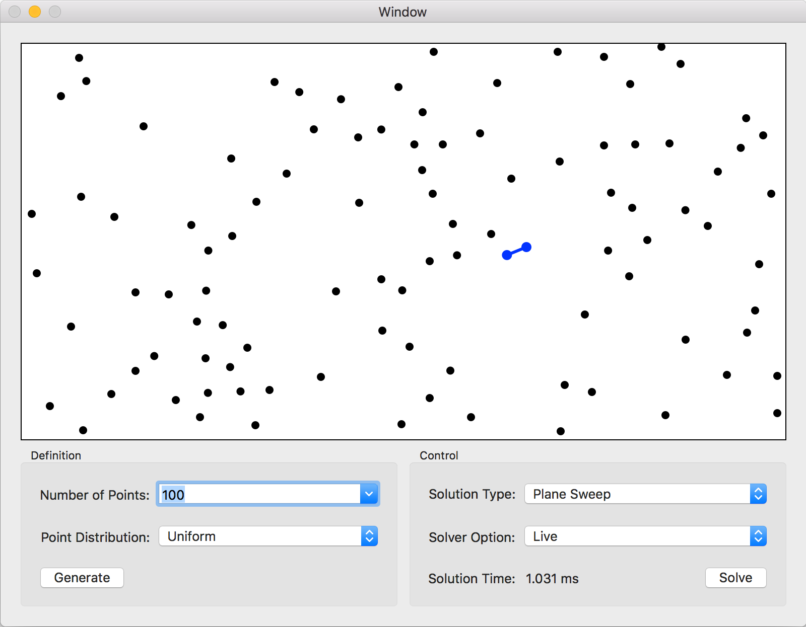

# ClosestPointsWorkshop

This project explores four solution types to the "Closest Points" problem. The project is written in Swift (originally 3.0 but migrated to 4.0) for macOS. It is composed as an Xcode 9 workspace and is configured to target El Capitan or higher. The ClosestPoints project implements the Closest Points application solution. The workspace also contains two frameworks projects to facilitate mocking in Swift: PDLTestBench and PDLToolBox. PDLTestBench defines "player" and "recorder" classes that enable one, respectively, to define expected events and behaviors for mock classes, and to capture actual events and behaviors for mock and spy classes. PDLToolBox defines some basic data structure classes that are used by PDLTestBench.

Four "Closest Points" solution types are explored:

1. Permutation Search - A purely naive matching of all permutations with ordering (even though ordering doesn't really matter). This solution is the easiest to test-drive without knowing any algorithm. The permutation search is O(n!).
2. Combination Search - A better naive matching of all combination regardless of ordering. This solution can be test-driven, provided the developer observes that the checking of points does not depend on order. The combination search is O(n!)/2 (i.e., "n choose 2").
3. Plane Sweep - An efficient matching of points where the points are ordered by their x position and then the plane is swept, looking for best matches in a sliding window whose size is based on the best match found so far. This solution can be test-driven provided the developer has worked out the algorithm a priori (i.e., the critical operations of the algorithm are test-driven, and then the integration of those operations is test-driven). This method is O(n log n).
4. Divide and Conquer - An efficient matching of points where the points are ordered by their x position and then recursively bisected into smaller regions until the point set is sufficiently small to easily search. This solution can be test-driven provided the developer has worked out the algorithm a priori (i.e., the critical operations of the algorithm are test-driven, and then the integration of those operations is test-driven). This method is O(n log n).

The application allows you to set the number of points to be randomly generated (2 <= n <= 100000). The random pattern can be Uniform or Clustered (Gaussian). For additional flexibility, the user has the ability to change the positions of points by dragging them with the mouse.

Clicking the "Solve" button triggers a run of the chosen solution algorithm. The user has the ability to abort the solution by clicking the "Cancel" button.

The application gives the user the ability to run the solution four ways:

1. One Shot - Run the solution once per click of the "Solve" button
2. Slow Animation - Run the solution once per click of the "Solve" button, while animating the solution steps slowly for visibility into the mechanics of the solution algorithm
3. Fast Animation - Run the solution once per click of the "Solve" button, while animating the solution steps rapidly for visibility into the mechanics of the solution algorithm
4. Live - Run the solution every time the point data set changes, either by genererating a new point set or by changing the position of one of the points.

The performance of the Divide and Conquer algorithm is affected by the acceptable size of the "sufficiently small" point region that terminates the recursive bisection operation. The application allows for selecting 3-point, 5-point, and 7-point sizes as a means of comparing these performance differences.

